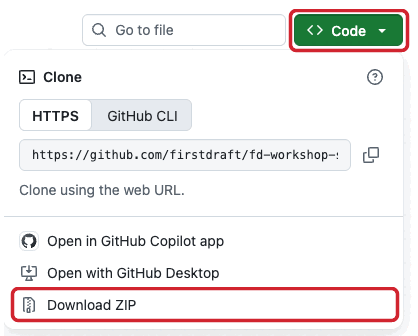
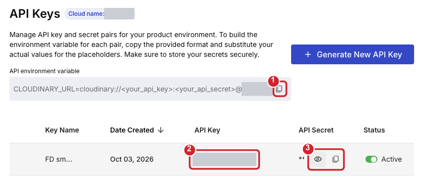

# First Draft workshop

Everything happens in Claude Desktop's **Code** tab. You type a request, and Claude does the work.

**Can't install programs on this laptop, or prefer not to let Claude work on your own computer?** Follow the
[Codespace guide](https://github.com/firstdraft/drawing-board#readme) instead. Everything there runs in your
browser.

Plan on:

- **Setting up your laptop:** 20 to 60 minutes. It takes longer if your laptop needs to restart.
- **Signing in to your accounts:** about 20 minutes.
- **Building, launching and previewing your first app:** about 45 minutes.

## Part 1: Set up your laptop

1. Download this repo as a Zip folder.

   
2. Right-click the zip file you downloaded and choose "Extract All...".
   Extract it to your Documents folder or someplace you can easily find.
   **On a Mac:** double-click the zip file instead. It unzips into a folder next to it.
3. Open Claude Desktop, go to the Code tab, and open the extracted "workshop-kit" folder.
4. Start the setup. Type:
   ```text
   Set up my laptop for the workshop
   ```
   Claude installs the programs you need. On Windows, it first turns on WSL (Windows Subsystem for Linux) and
   installs Ubuntu, a Linux system that runs inside Windows, where your apps and their tools will live. Click **Yes**
   when Windows asks for permission. If Claude asks you to restart, do so, then reopen the same folder in Claude
   Desktop and type `continue`.
   **On a Mac:** Claude opens a Terminal window to install Homebrew. When it asks for your password, type your Mac
   password there and press Return (nothing shows as you type), and press Return when it asks. Claude never asks
   for your password.
5. When prompted, choose and enter a name for your project.

## Part 2: Sign in to your accounts

When you first try to sign in to First Draft, you'll hit a username/password wall. Ask your instructor for that.

6. Open a new session in Claude Desktop. Choose `WSL` &rarr; `Ubuntu-24.04` instead of `Local`.
   For "Choose folder", select the folder with the name of your project (`home` &rarr; `appdev` &rarr;
   `YOUR_PROJECT`).
   **On a Mac:** first quit Claude Desktop (Cmd-Q) and open it again. Then keep `Local`, and choose the `workshop`
   folder in your home folder, then `YOUR_PROJECT`. Use `Local` wherever these steps say `WSL`.
7. Type `/workshop-signin` and press Enter. Claude opens each sign-in page in your browser and copies any code you
   need to your clipboard. Approve each one and tell Claude when you are done, until every account is signed in.
   - **Cloudinary** stores your app's photos and has nothing to approve. After you sign up, Claude opens its
     **API Keys** page. Copy the three things marked below, one at a time and in order, and tell Claude after each
     copy. Claude saves each one from your clipboard without showing it.

     

## Part 3: Build your first app

8. Open a new session (`WSL` &rarr; `Ubuntu-24.04`, your project folder) and type:
   ```text
   /create-full-stack-app Help me build a social network for just my family. It should work and look like Instagram so that it's familiar.
   ```
9. Claude first looks up how similar apps work, then asks a few questions, one at a time. One of them is how
   involved you want to be in technical decisions. Answer in your own words, or say "you pick". At any point you can
   say "make the rest of the decisions for me".
10. A few minutes in, Claude tells you what First Draft will and won't build. Then it shows you a summary of the
    plan. Change anything you like: it's your app. When it looks right, approve it. Building takes about a minute.
11. Start the web app:
    ```text
    Start the web app.
    ```
    Open `http://localhost:3000` in your browser. If your app has sign-in, use the demo login Claude shows you.
    Try posting a photo, liking a post, and following someone.
12. Save your work to GitHub:
    ```text
    Commit the app and push it to a new private repository on my GitHub account. Give me the link.
    ```
    Pushing also starts GitHub building your iPhone and Android apps. That takes about five minutes, so carry on.
13. Put your app on the internet:
    ```text
    Deploy this app to Render's free plan with a Neon database. Give me the link when it's live.
    ```
    Claude will ask you to create a Render workspace for this app first, so each app gets its own free hours.
    The first deploy takes a few minutes. Your live app starts with no data: the sample data is only on your laptop.
    Sign up on the live app to try it: you are signed in right away. "Forgot password" emails are not sent until an
    email provider is set up.

    
14. Try your app on a phone, in your browser:
    ```text
    Show me the Android app in Revyl.
    ```
    Then:
    ```text
    Now show me the iPhone app.
    ```
    The link opens a phone in your browser. If Revyl asks you to sign in, use the same account as before. Inside your
    app, sign in with the same demo login as on your laptop.
15. Make it yours. Ask for one change at a time, then try it on your laptop. Some ideas:
    ```text
    Style it similar to Instagram.
    ```
    ```text
    Limit how many people someone can follow to 50.
    ```
    ```text
    Only allow sign-ups from @YOURFAMILY.com email addresses.
    ```
    When you like a change, say `Commit and push.` Render updates the live app a minute or two later.

## Part 4: Start over with your own idea

16. Ask Claude for a new project folder:
    ```text
    Make a new project folder called MY_IDEA next to this one.
    ```
17. Have sketches, notes, design documents or spreadsheets for your idea? Put them in your Downloads folder and
    ask Claude to copy them in:
    ```text
    Copy FILE_NAME from my Downloads folder into MY_IDEA.
    ```
    If you designed your app in Claude Design, choose **Export** &rarr; **Hand off to Claude Code** there and copy
    what it gives you.
18. Open a new session (`WSL` &rarr; `Ubuntu-24.04`, the new folder) and describe your idea:
    ```text
    /create-full-stack-app A place for my book club to pick the next book and vote on meeting dates.
    ```
    Mention any files you copied in, and paste your Claude Design handoff after your idea. Your sign-ins carry over,
    so you can go straight to building.

## If something goes wrong

- **The page stopped loading:** type `Restart the web app.`
- **Claude seems stuck:** press `Esc`, then type `continue`.
- **Building seems stuck for more than five minutes:** type `Cancel the stuck compile and try again.`
- **Claude asks you to approve something:** it checks before risky steps, such as deploying. Approve it if it is
  what you asked for.
- **The same step fails twice:** raise your hand, and leave the error on screen for the instructor.

## After the workshop

- To come back to a project, open a session with `WSL` &rarr; `Ubuntu-24.04` (on a Mac, `Local`) and choose its
  folder.
- Render's free plan sleeps when nobody visits, so the first visit afterwards takes about a minute.
- To remove an app from the internet, ask Claude: `Delete this app's Render service and its Neon project.`
