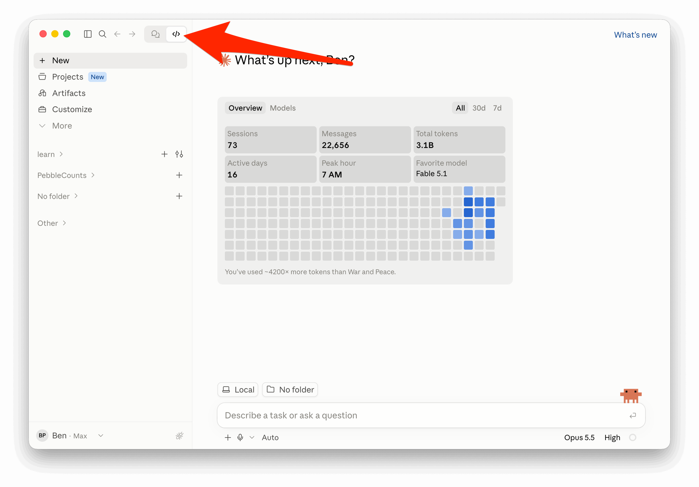
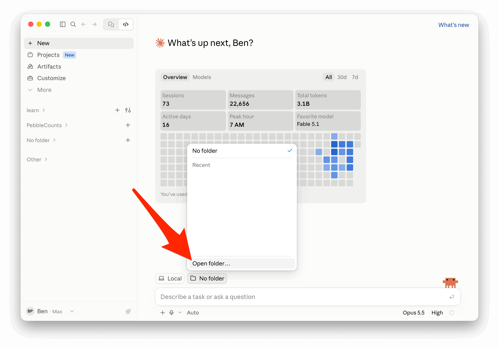
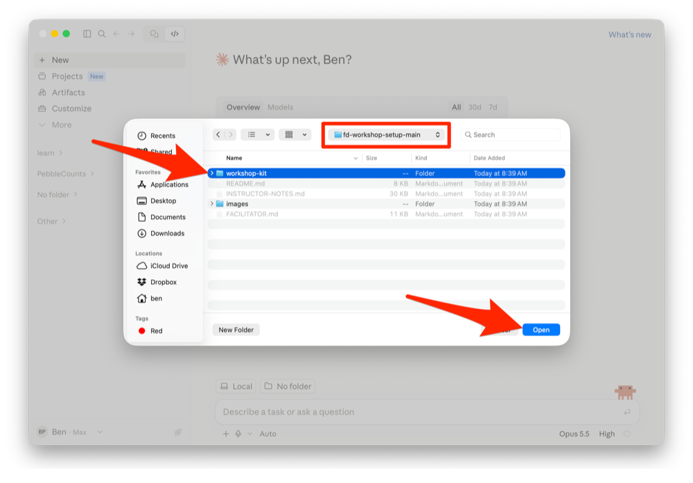
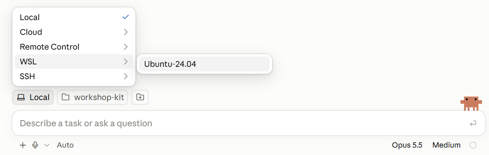
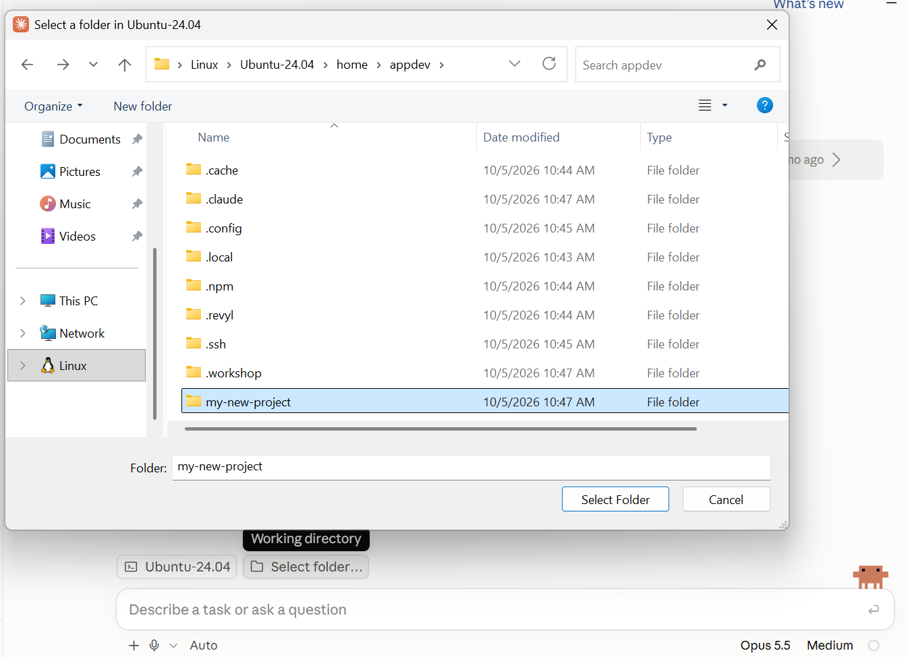
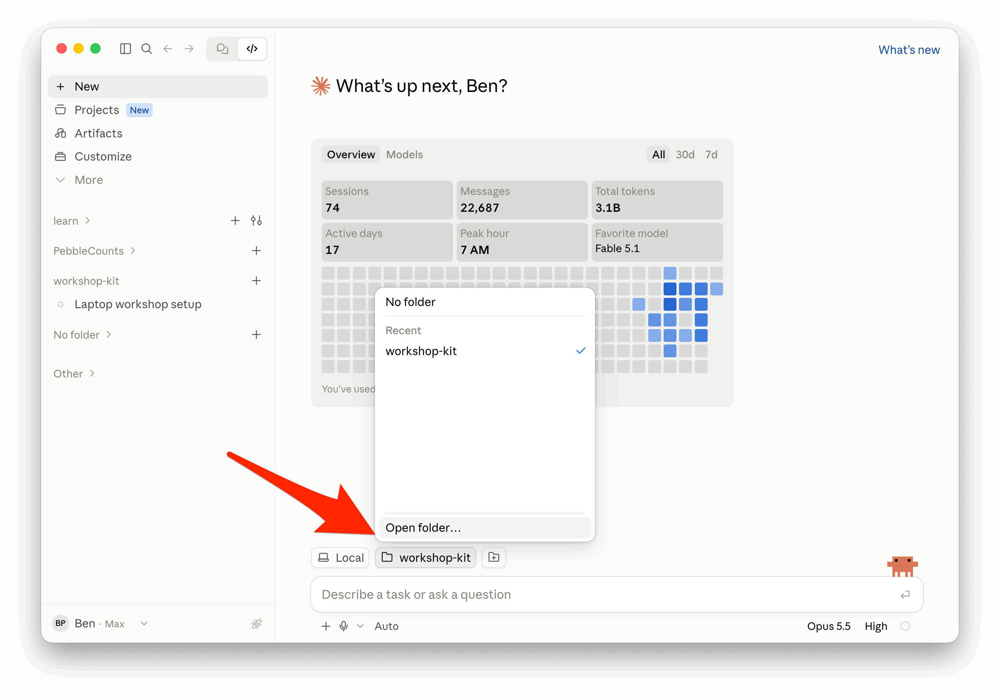
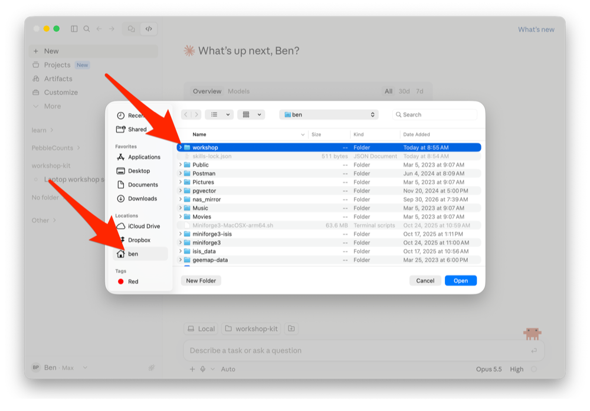
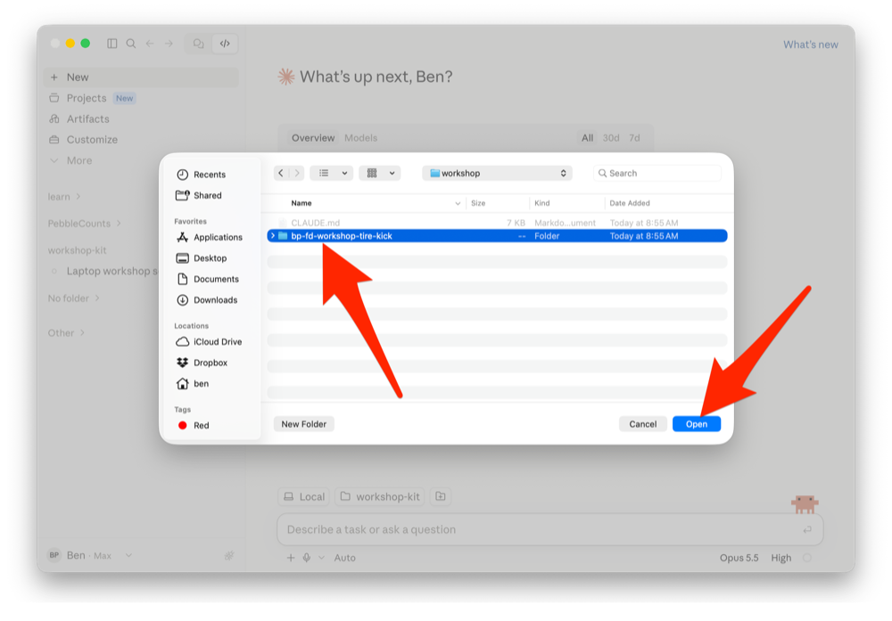

# First Draft workshop

Everything happens in Claude Desktop's **Code** tab. You type a request, and Claude does the work.

**Can't install programs on this laptop, or prefer not to let Claude work on your own computer?** Follow the
[Codespace guide](https://github.com/firstdraft/drawing-board#readme) instead. Everything there runs in your
browser.

Plan on:

- **Setting up your laptop:** 20 to 60 minutes. It takes longer if your laptop needs to restart.
- **Signing in to your accounts:** about 20 minutes.
- **Building, launching and previewing your app:** about 45 minutes, or longer for a bigger idea.

## Part 1: Set up your laptop

1. Download this repo as a Zip folder.

   
2. Unzip the file you downloaded.

   **Windows users:** right-click the zip file and choose "Extract All...". Extract it to your Documents folder or
   someplace you can easily find.

   **Mac users:** double-click the zip file. It unzips into a folder next to it.
3. [Open Claude Desktop](https://claude.com/download), go to the Code tab, and open the extracted "workshop-kit" folder.

   

   

   The folder picker below is from a Mac. **Windows users:** yours looks similar. Find the folder you extracted in
   step 2, select `workshop-kit` inside it, and click **Select Folder**.

   
4. Start the setup. Type:
   ```text
   Set up my laptop for the workshop
   ```
   Claude installs the programs you need.

   **Windows users:** Claude first turns on WSL (Windows Subsystem for Linux) and installs Ubuntu, a Linux system
   that runs inside Windows, where your apps and their tools will live. Click **Yes** when Windows asks for
   permission. If Claude asks you to restart, do so, then reopen the same folder in Claude Desktop and type
   `continue`.

   **Mac users:** Claude opens a Terminal window to install Homebrew. When it asks for your password, type your Mac
   password there and press Return (nothing shows as you type), and press Return when it asks. Claude never asks
   for your password.
5. When prompted, choose a name for your project. Claude creates your project's folder with that name.

   **Windows users:** the folder is inside Linux (`home` &rarr; `appdev`), because apps there run much faster than
   on the Windows drive.

   **Mac users:** Claude first asks where to keep your projects: `appdev` in your home folder, or another folder you
   choose. Never choose Dropbox, iCloud Drive (including Desktop and Documents, if iCloud syncs them), Google Drive
   or another synced folder: syncing damages your app's files, and GitHub is your backup.

## Part 2: Sign in to your accounts

When you first try to sign in to First Draft, you'll hit a username/password wall. Ask your instructor for that.

6. Open a new session in Claude Desktop, in your project's folder.

   **Windows users:** choose `WSL` &rarr; `Ubuntu-24.04` instead of `Local`. Then click "Select folder..." and pick
   the folder with the name of your project (`home` &rarr; `appdev` &rarr; `YOUR_PROJECT`).

   

   

   **Mac users:** first quit Claude Desktop (Cmd-Q) and open it again. Then keep `Local`, and open the projects
   folder from step 5 (`appdev` in your home folder, unless you picked another), then `YOUR_PROJECT`.

   

   

   
7. Type `/workshop-signin` and press Enter. Claude signs you in to the services your app uses, **one at a time, in
   the order below**. For each one, Claude opens its page in your browser and copies any code you need to your
   clipboard. Sign up or approve there, then come back and tell Claude you're done. **Wait for Claude to ask before
   you start the next one.**
   - **GitHub** stores your app's code. Claude also sets the name and email on your commits and adds your laptop's
     key to GitHub, so it can save your work there without a password.
   - **Render** puts your app on the internet.
   - **Neon** runs your app's database on the internet.
   - **Cloudinary** stores the photos people upload to your app. It has nothing to approve: after you sign up,
     Claude opens its **API Keys** page and asks you to copy the three things marked below, one at a time and in
     order. Tell Claude after each copy; Claude saves each one from your clipboard without showing it.

     
   - **Revyl** shows your iPhone and Android app on a phone in your browser.
   - **First Draft** plans and builds your app. This is where the username and password wall appears: ask your
     instructor.

   When Claude says you're all signed in, go on to Part 3.

## Part 3: Build your app

Build your own idea. No idea yet? Step 9 has a family social network you can build instead.

8. Bring what you have. Copy any materials for your idea into your project folder: wireframes, Figma or Claude
   Design exports, photos of hand-drawn sketches, or sample data as CSV files. Use sample or anonymized data, not
   real people's information.
   - **Already built a version in Lovable?** On its GitHub repository, choose **Code** &rarr; **Download ZIP**, and
     unzip it into a folder named `lovable` inside your project folder. Don't `git clone` it into your project
     folder: Claude saves your new app with Git there, and could push it to your Lovable repository.
   - **Designed it in Claude Design?** Choose **Export** &rarr; **Hand off to Claude Code** there, and keep what it
     gives you for step 9.

   **Windows users:** File Explorer shows your project folder under **Linux** &rarr; `Ubuntu-24.04` &rarr; `home`
   &rarr; `appdev` &rarr; `YOUR_PROJECT`.

   **Mac users:** your project folder is in the projects folder from step 5.

   When Claude builds your app, it moves these materials into `.firstdraft/design` inside the project folder.
9. Open a new session in your project folder, as in step 6.

   **Windows users:** remember to choose `WSL` &rarr; `Ubuntu-24.04`.

   **Mac users:** keep `Local`.

   Then describe your idea in a sentence or two:
   ```text
   /create-full-stack-app A place for my book club to pick the next book and vote on meeting dates. Read the materials in this folder first.
   ```
   Leave out the last sentence if you didn't bring any materials, and paste a Claude Design handoff after your
   idea. No idea yet? Type this instead:
   ```text
   /create-full-stack-app Help me build a social network for just my family. It should work and look like Instagram so that it's familiar.
   ```
10. Claude first looks up how similar apps work, then asks a few questions, one at a time. One of them is how
    involved you want to be in technical decisions. Answer in your own words, or say "you pick". At any point you can
    say "make the rest of the decisions for me".
11. A few minutes in, Claude tells you what First Draft will and won't build. If it can build only part of your
    idea, that's expected: continue with what it builds, or switch to the family social network from step 9. Then
    Claude shows you a summary of the plan. Change anything you like: it's your app. When it looks right, approve
    it. Building takes about a minute.
12. Start the web app:
    ```text
    Start the web app.
    ```
    Open `http://localhost:3000` in your browser. If your app has sign-in, use the demo login Claude shows you.
    Try each thing your app lets people do.
13. Save your work to GitHub:
    ```text
    Commit the app and push it to a new private repository on my GitHub account. Give me the link.
    ```
    Pushing also starts GitHub building your iPhone and Android apps. That takes about five minutes, so carry on.
14. Put your app on the internet:
    ```text
    Deploy this app to Render's free plan with a Neon database. Give me the link when it's live.
    ```
    Claude will ask you to create a Render workspace for this app first, so each app gets its own free hours.
    The first deploy takes a few minutes. Your live app starts with no data: the sample data is only on your laptop.
    Sign up on the live app to try it: you are signed in right away. "Forgot password" emails are not sent until an
    email provider is set up.

    
15. Try your app on a phone, in your browser:
    ```text
    Show me the Android app in Revyl.
    ```
    Then:
    ```text
    Now show me the iPhone app.
    ```
    The link opens a phone in your browser. If Revyl asks you to sign in, use the same account as before. Inside your
    app, sign in with the same demo login as on your laptop.
16. Make it yours. Ask for one change at a time, then try it on your laptop. Some ideas, with the examples swapped
    for your own:
    ```text
    Style it similar to Airbnb.
    ```
    ```text
    Limit how many posts each person can create to 50.
    ```
    ```text
    Only allow sign-ups from @MYCOMPANY.com email addresses.
    ```
    When you like a change, say `Commit and push.` Render updates the live app a minute or two later.

## Part 4: Try another idea

17. Ask Claude for a new project folder:
    ```text
    Make a new project folder called ANOTHER_IDEA next to this one.
    ```
    Then repeat steps 8 to 16 with that folder, starting with a new session. Your sign-ins carry over, so you can go
    straight to building.

## If something goes wrong

- **The page stopped loading:** type `Restart the web app.`
- **Claude seems stuck:** press `Esc`, then type `continue`.
- **Building seems stuck for more than five minutes:** type `Cancel the stuck compile and try again.`
- **Claude asks you to approve something:** it checks before risky steps, such as deploying. Approve it if it is
  what you asked for.
- **The same step fails twice:** raise your hand, and leave the error on screen for the instructor.

## After the workshop

- To come back to a project, open a session and choose its folder.
  - **Windows users:** choose `WSL` &rarr; `Ubuntu-24.04`.
  - **Mac users:** keep `Local`.
- Render's free plan sleeps when nobody visits, so the first visit afterwards takes about a minute.
- To remove an app from the internet, ask Claude: `Delete this app's Render service and its Neon project.`
